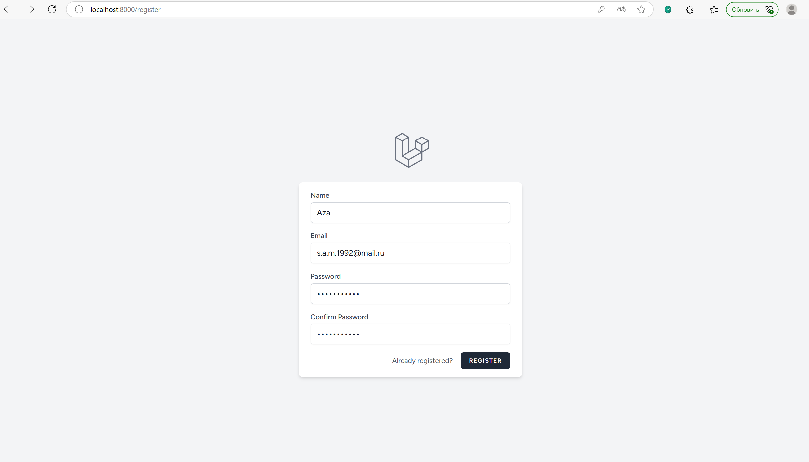
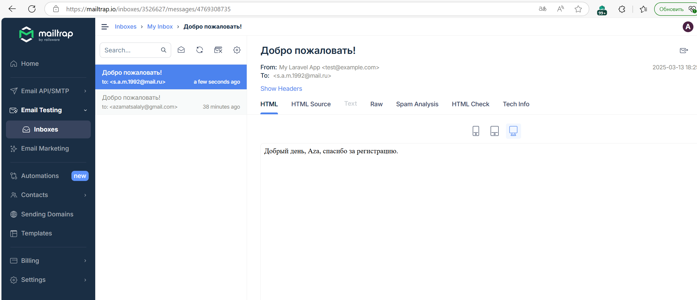

# Telegram Bot на Laravel

Проект реализует регистрацию пользователей с отправкой уведомлений через Email и Telegram. Создан в рамках курса GeekBrains для практики интеграции внешних сервисов, таких как Mailtrap и Telegram Bot API.

---

## 📌 Функциональность

- 🔐 **Регистрация и аутентификация** пользователей через Laravel.
- 📧 **Email-уведомления**: приветственное письмо новым пользователям (через Mailtrap).
- 🤖 **Telegram-уведомления**: сообщение в Telegram-канал о регистрации нового пользователя.
- 🔍 **Тестовый маршрут** `/test-telegram` для проверки Telegram-уведомлений.

---

## 🛠 Технологии

- **Backend**: PHP, Laravel
- **Внешние сервисы**:
  - Telegram Bot API (`irazasyed/telegram-bot-sdk`)
  - Mailtrap (SMTP для тестирования почты)
- **Инструменты**: Composer, Git

---

## Скриншоты





---

## 🚀 Установка и запуск

### 1. Клонируйте репозиторий

```bash
git clone https://github.com/AzaS31/Laravel-Telegram.git
cd Laravel-Telegram
```

### 2. Установите зависимости

```bash
composer install
```

### 3. Настройте файл окружения

```bash
cp .env.example .env
```

Затем отредактируйте `.env`, указав данные Mailtrap и Telegram-бота:

```env
MAIL_MAILER=smtp
MAIL_HOST=smtp.mailtrap.io
MAIL_PORT=2525
MAIL_USERNAME=ваш-username-mailtrap
MAIL_PASSWORD=ваш-пароль-mailtrap
MAIL_FROM_ADDRESS=ваш-email@example.com
MAIL_FROM_NAME="${APP_NAME}"

TELEGRAM_CHANNEL_ID=ваш-id-канала-telegram
TELEGRAM_BOT_TOKEN=ваш-токен-бота
```

### 4. Сгенерируйте ключ приложения

```bash
php artisan key:generate
```

### 5. Настройте базу данных

Укажите параметры подключения к базе данных в `.env` (MySQL, SQLite и т.д.).

Затем выполните миграции:

```bash
php artisan migrate
```

### 6. Запустите приложение

```bash
php artisan serve
```

---

## ✅ Проверка функциональности

### Telegram

Перейдите по адресу:

```
http://localhost:8000/test-telegram
```

> Убедитесь, что сообщение появилось в вашем Telegram-канале.

### Email

- Зарегистрируйте нового пользователя.
- Проверьте входящие письма в Mailtrap.

---

## 📁 Структура проекта

| Компонент | Описание |
|----------|----------|
| `RegisteredUserController` | Обработка регистрации и отправка уведомлений |
| `App\Mail\Welcome.php` | Класс приветственного письма |
| `resources/views/emails/welcome.blade.php` | HTML-шаблон письма |
| `routes/web.php` | Включает маршрут `/test-telegram` |

---

## 🎯 Цели проекта

- Изучить отправку email-уведомлений через SMTP (Mailtrap)
- Освоить интеграцию с Telegram через Telegram Bot API
- Реализовать регистрацию и аутентификацию в Laravel
- Настроить безопасное хранение конфиденциальных данных

---

## ⚠️ Примечания

- Убедитесь, что Telegram-бот **добавлен в канал** и имеет права **на отправку сообщений**.
- Mailtrap используется **только для разработки** — не отправляет письма настоящим пользователям.
- Проект предназначен **для локальной разработки и тестирования**.

---

## 🧑‍💻 Автор

**Azamat S.**  
[GitHub: @AzaS31](https://github.com/AzaS31)

---

## 📜 Лицензия

Проект доступен под лицензией MIT.


